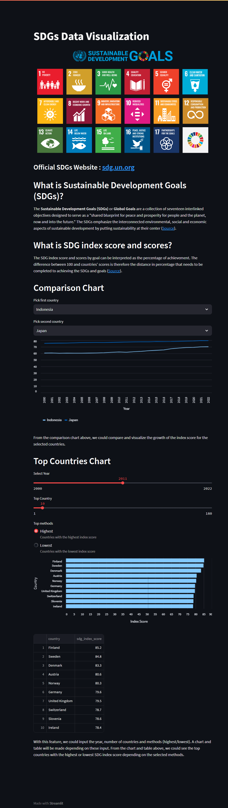
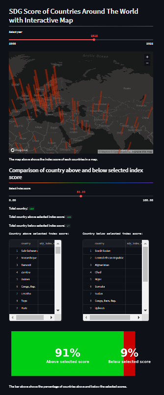
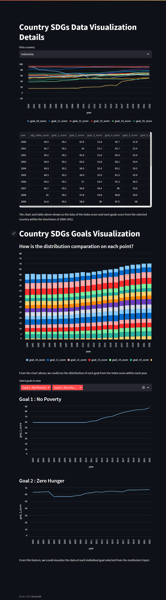

# **SDGs Data Visualization App**


## About This Project

- The main objective behind the making of this app is to help user visualize and view data related to the SDG scores of countries around the globe.

## How to Run This Project

1. Install virtual environment (Optional)

```bash
pip install virtualenv
```

2. Create virtual environment for project (Optional)

```bash
python -m venv {virtual env name}
```

- Example:

```bash
python -m venv sickathon
```

3. Run virtual environment (Optional)
   - Example in windows

```bash
venv\Scripts\activate
```

4. Install requirements

```bash
pip install -r requirements.txt
```

5. Create secrets.toml file

```bash
mkdir .streamlit
cd .streamlit
code secrets.toml
```

6. Create connection in secrets.toml file

```bash
[connections.sdg_db]
url = "sqlite:///sdg.db"
```

7. Run project

```bash
streamlit run home.py
```

## Features

- ### Comparison
  This feature allows user to compare SDGs index score between 2 countries from the year 2000 until 2022 in a form of a line chart to help user visualize it.
- ### Top Countries

  This feature allows user to view and visualize the top countries based on its Index Score within the selected year. There are 2 methods available to be chosen.

  1. #### Highest Method

     With this method selected, the top countries shown will be the countries with the **highest** index score.

  2. #### Lowest Method
     With this method selected, the top countries shown will be the countries with the **lowest** index score.

- ### Country SDGs Data View

  This features allows user to view data of the selected country in a more detailed fashion. Charts of every goals within the timeframe of year 2000-2022 will be shown.

  User will also be able to view every single SDGs goal data in a form of a single line chart if selected in the multiselect box.

- ### Interactive Map
  This feature allows user to select a year and an interactive map will be shown. User will be able to view a map and in a more interactive way and see the index score of each country within the selected year.
- ### Index Score Overview

  This feature allows user to select a year and an index score in which the user set as a point to compare the index score of each countries.

  The app will then show the number of countries with the index score above and under the selected score in a form of a number, table and a bar.

## UI





## References

- **Datasets Used In This Project**

  1. https://www.kaggle.com/datasets/sazidthe1/sustainable-development-report
  2. https://www.kaggle.com/datasets/paultimothymooney/latitude-and-longitude-for-every-country-and-state/code
